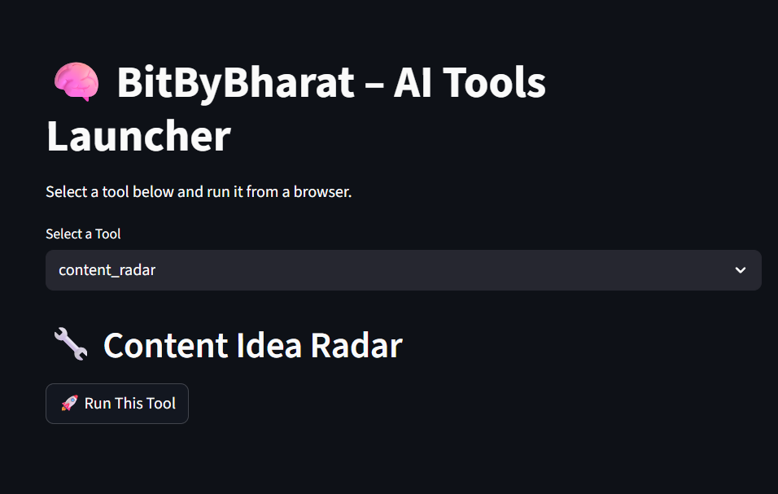
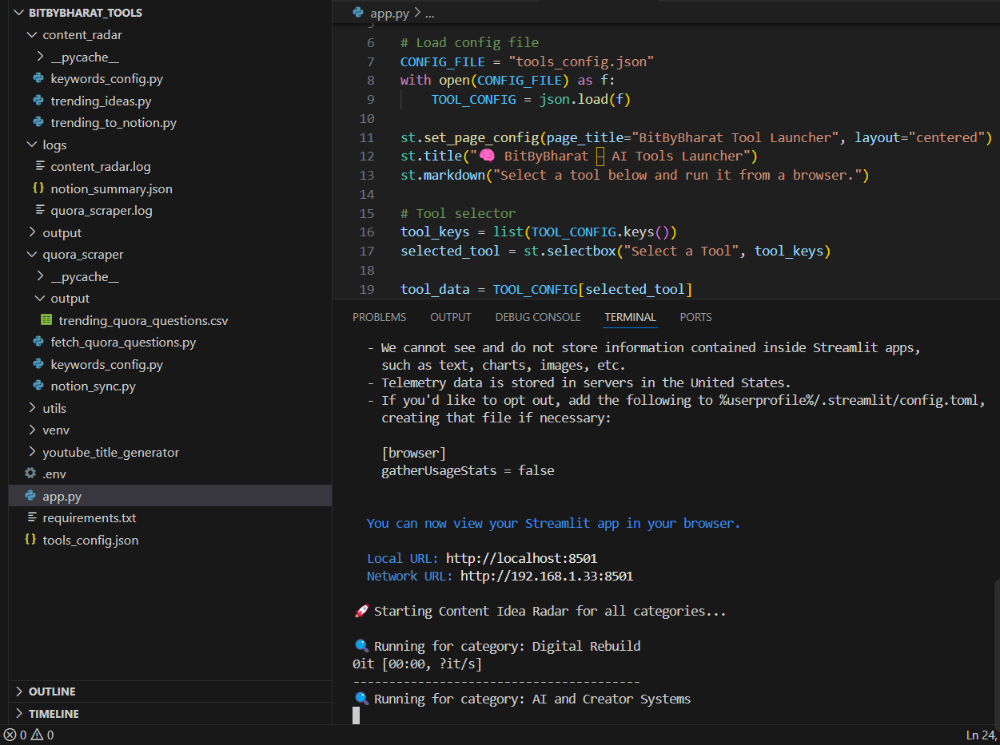

# 🛠️ BitByBharat AI Tools Dashboard (Local Streamlit App)

Welcome to **BitByBharat_Tools** — a local browser-based AI dashboard built with **Streamlit**, designed to trigger and visualize internal Python tools like:

- 🧠 Content Idea Radar (NewsAPI → Notion)
- ❓ Quora Trend Scraper (SerpAPI → Notion)

This system gives me a visual, click-and-run interface for my content tools, built without frontend coding, deployed entirely locally — and expandable.

---

## 📌 Features

- ✅ Run tools via buttons in browser
- ✅ View logs + real-time Notion sync summary
- ✅ View clickable links to added articles/questions
- ✅ Modular architecture — drop in new tools anytime

---

## 🧱 Folder Structure

```
BitByBharat_Tools/
├── app.py
├── tools_config.json
├── requirements.txt
├── .env (ignored from Git)
│
├── content_radar/
│   ├── trending_ideas.py
│   ├── trending_to_notion.py
│   └── keywords_config.py
│
├── quora_scraper/
│   ├── fetch_quora_questions.py
│   ├── notion_sync.py
│   └── keywords_config.py
│
├── logs/
│   ├── content_radar.log
│   ├── quora_scraper.log
│   ├── notion_summary.json
│   └── *_ui_result.json
```

---

## 🔐 Environment Setup (`.env`)

> ⚠️ `.env` file is **excluded from GitHub via `.gitignore`** to protect sensitive API keys.

Create a file named `.env` in the root folder with the following content:

```env
NOTION_TOKEN=your_notion_token
NOTION_DB_ID_CONTENT_IDEAS=your_content_idea_db_id
NOTION_DB_ID_QUORA_QUESTIONS=your_quora_db_id
NEWS_API_KEY=your_newsapi_key
SERPAPI_KEY=your_serpapi_key
```

---

## ⚙️ Installation Instructions

### 1. Clone the Repository

```bash
git clone https://github.com/BitByBharat/BitByBharat_Tools.git
cd BitByBharat_Tools
```

### 2. Create a Virtual Environment

```bash
python -m venv venv
source venv/bin/activate         # macOS/Linux
venv\Scripts\activate          # Windows
```

### 3. Install Requirements

```bash
pip install -r requirements.txt
```

---

## 🖥️ Run the Streamlit Dashboard

```bash
streamlit run app.py
```

Your browser will open at:  
👉 `http://localhost:8501`

---

## 🧪 Run Tools Individually (Optional)

```bash
python content_radar/trending_ideas.py
python quora_scraper/fetch_quora_questions.py
```

Each tool writes logs and summaries into `/logs/` and pushes output to Notion.

---

## 📸 Screenshots

### Streamlit Web UI


### VS Code Folder View


---

## 💡 Built With

- [Streamlit](https://streamlit.io)
- [NewsAPI](https://newsapi.org)
- [SerpAPI](https://serpapi.com)
- [Notion SDK for Python](https://developers.notion.com)

---

## 📦 License

MIT — use it, fork it, remix it.

---

## 👋 Author

**[BitByBharat](https://bitbybharat.com)**  
Solo builder. Failed founder. Rebuilding publicly with AI.